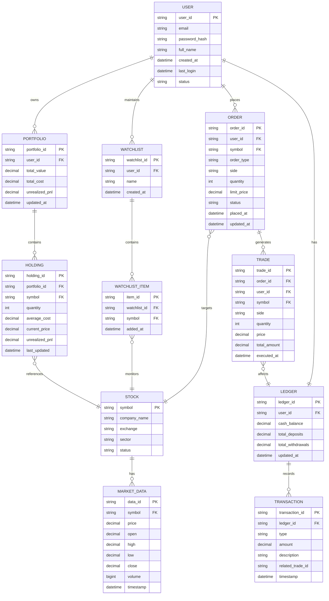

## Entity-Relationship Diagram

The following ER diagram illustrates the core data model for the SB Stocks paper trading application:

### Key Entities

- **USER:** Core entity representing registered users with authentication credentials
- **PORTFOLIO:** Aggregated view of a user's holdings and overall performance
- **HOLDING:** Individual stock positions with quantity and cost basis tracking
- **STOCK:** Master list of tradable instruments
- **MARKET_DATA:** Real-time and historical price information
- **ORDER:** User-initiated trading instructions (market, limit, stop orders)
- **TRADE:** Executed transactions resulting from filled orders
- **LEDGER:** Virtual cash account for each user
- **TRANSACTION:** Detailed cash flow records (deposits, withdrawals, trade settlements)
- **WATCHLIST:** User-curated lists of stocks to monitor
- **WATCHLIST_ITEM:** Individual stocks within a watchlist

### Relationships

- Each USER can have one PORTFOLIO and one LEDGER
- A PORTFOLIO contains multiple HOLDINGs
- Each HOLDING references a specific STOCK
- ORDERs are placed by USERs and target specific STOCKs
- Filled ORDERs generate TRADEs that update the LEDGER and PORTFOLIO
- MARKET_DATA provides pricing information for STOCKs
- WATCHLISTs organize stocks for monitoring without trading

### Design Considerations

- **Auditability:** TRANSACTION and TRADE tables maintain complete history
- **Data Integrity:** Foreign key constraints ensure referential integrity
- **Performance:** Indexed on user_id, symbol, and timestamp fields
- **Scalability:** Separates market data from user-specific trading data